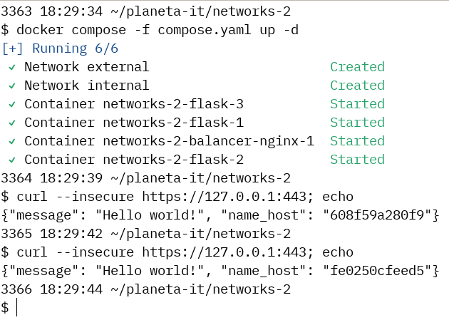

# Решение задания 2-ого этапа конкурса &laquo;Современные сетевые технологии&raquo;

## Запуск балансировщика и web-серверов

```shell
docker compose --file compose.yaml up --detach
```

## Запуск скрипта, печатающего ответы от балансируемых web-серверов

```shell
chmod 700 print_responses.sh
```

```shell
./print-responses.sh
```

## Демонстрация работы

